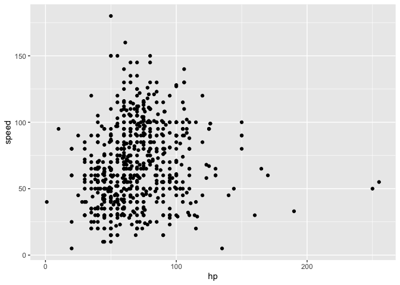
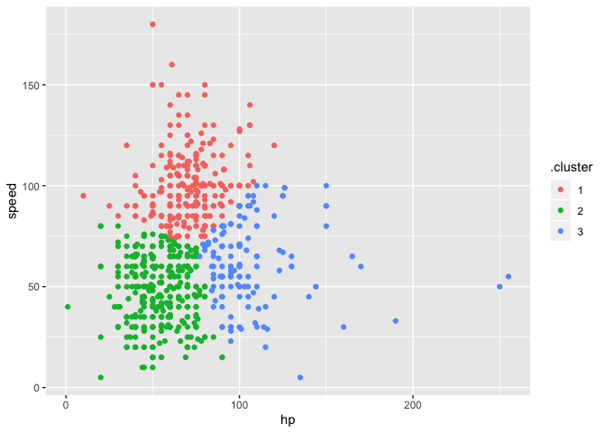

statistical\_learning
================
Xin He
11/26/2019

``` r
bwt_df = 
  read_csv("./data/birthweight.csv") %>% 
  janitor::clean_names() %>%
  mutate(
    babysex = as.factor(babysex),
    babysex = fct_recode(babysex, "male" = "1", "female" = "2"),
    frace = as.factor(frace),
    frace = fct_recode(frace, "white" = "1", "black" = "2", "asian" = "3", 
                       "puerto rican" = "4", "other" = "8"),
    malform = as.logical(malform),
    mrace = as.factor(mrace),
    mrace = fct_recode(mrace, "white" = "1", "black" = "2", "asian" = "3", 
                       "puerto rican" = "4")) %>% 
  sample_n(200)
```

    ## Parsed with column specification:
    ## cols(
    ##   .default = col_double()
    ## )

    ## See spec(...) for full column specifications.

## have look at glmnet

``` r
x = model.matrix(bwt ~ ., bwt_df)[,-1]
y = bwt_df$bwt
```

``` r
lambda = 10^(seq(3, -2, -0.1))

lasso_fit =
  glmnet(x, y, lambda = lambda)

lasso_cv =
  cv.glmnet(x, y, lambda = lambda)

lambda_opt = lasso_cv$lambda.min
```

``` r
broom::tidy(lasso_fit) %>% 
  select(term, lambda, estimate) %>% 
  complete(term, lambda, fill = list(estimate = 0) ) %>% 
  filter(term != "(Intercept)") %>% 
  ggplot(aes(x = log(lambda, 10), y = estimate, group = term, color = term)) + 
  geom_path() + 
  geom_vline(xintercept = log(lambda_opt, 10), color = "blue", size = 1.2) +
  theme(legend.position = "none")
```

<!-- -->

``` r
broom::tidy(lasso_cv) %>% 
  ggplot(aes(x = log(lambda, 10), y = estimate)) + 
  geom_point()  
```

<!-- -->

## clustering: examples

``` r
poke_df = 
  read_csv("./data/pokemon.csv") %>% 
  janitor::clean_names() %>% 
  select(hp, speed)
```

    ## Parsed with column specification:
    ## cols(
    ##   `#` = col_double(),
    ##   Name = col_character(),
    ##   `Type 1` = col_character(),
    ##   `Type 2` = col_character(),
    ##   Total = col_double(),
    ##   HP = col_double(),
    ##   Attack = col_double(),
    ##   Defense = col_double(),
    ##   `Sp. Atk` = col_double(),
    ##   `Sp. Def` = col_double(),
    ##   Speed = col_double(),
    ##   Generation = col_double(),
    ##   Legendary = col_logical()
    ## )

``` r
poke_df %>% 
  ggplot(aes(x = hp, y = speed)) + 
  geom_point()
```

<!-- -->

``` r
kmeans_fit = 
  kmeans(poke_df, centers = 3)
```

**plot results**

``` r
poke_df =
  broom::augment(kmeans_fit, poke_df)

poke_df %>% 
  ggplot(aes(x = hp, y = speed, color = .cluster)) +
  geom_point()
```

<!-- -->

## Clustering: trajectories

``` r
traj_data = 
  read_csv("./data/trajectories.csv")
```

    ## Parsed with column specification:
    ## cols(
    ##   subj = col_double(),
    ##   week = col_double(),
    ##   value = col_double()
    ## )

``` r
traj_data %>% 
  ggplot(aes(x = week, y = value, group = subj)) + 
  geom_point() + 
  geom_path()
```

<!-- -->

``` r
int_slope_df = 
traj_data %>% 
  nest(data = week:value) %>% 
  mutate(
    models = map(data, ~lm(value ~ week, data = .x)),
    result = map(models, broom::tidy)
  ) %>% 
  select(subj, result) %>% 
  unnest(result) %>% 
  select(subj, term, estimate) %>% 
  pivot_wider(
    names_from = term,
    values_from = estimate
  ) %>% 
  rename(int = "(Intercept)", slope = week)
```

``` r
int_slope_df %>% 
  ggplot(aes(x = int, y = slope)) + 
  geom_point()
```

<!-- -->

kmeant the whole thing

``` r
km_fit = 
  kmeans(
    x = int_slope_df %>% select(-subj) %>% scale, 
    centers = 2)

int_slope_df =
  broom::augment(km_fit, int_slope_df)
```
